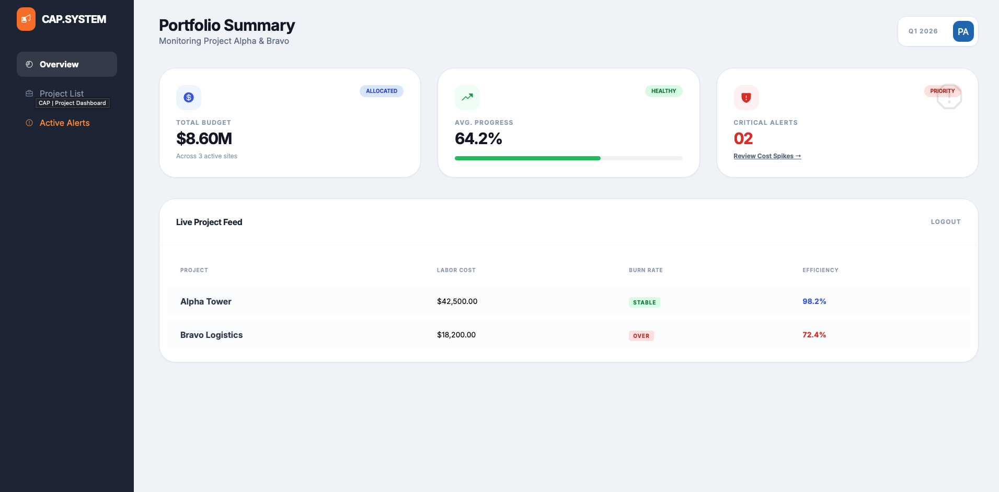
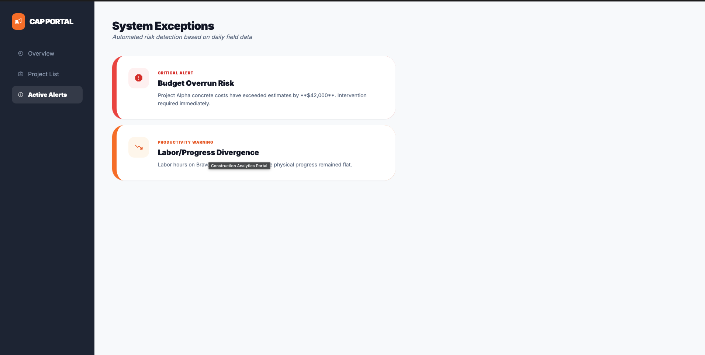
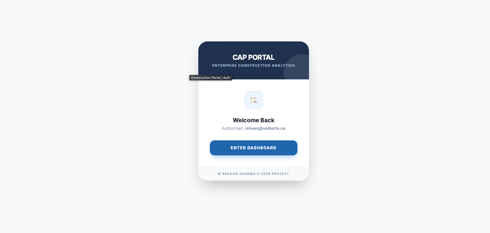

# Integrated Construction Analytics & Workflow Portal  
**Enterprise Construction Portfolio Project**

> I built a deployable internal portal that connects **daily construction field reporting** with **corporate project visibility** (cost, labor, progress).
>
> This project is designed to reflect how **large enterprise construction companies (e.g., firms like PCL and similar organizations)** operate internally.
>
> ⚠️ This is a **personal portfolio project** using **synthetic data** and **simulated ERP integrations**.  
> It is **not affiliated with or endorsed by any company**.

---

<p align="center">
  
</p>

## Why I built this

In large construction organizations, there is often a gap between:

- **What happens on site** (daily labor, progress, issues)
- **What corporate teams see** (cost reports, budget status, KPIs)

In many real environments, this data is:
- spread across spreadsheets  
- manually re-entered into ERP systems  
- reported weeks after the work actually happens  

That delay leads to:
- late awareness of cost overruns  
- slow reaction to productivity issues  
- duplicated effort between site and office teams  

### The problem I wanted to solve

> *How can daily field data flow into corporate systems quickly, consistently, and in a way that actually supports decision-making?*

### The goal of this project

To design and build **one internal system** that:
- captures daily site activity in a structured way  
- stores it in a central enterprise database  
- integrates with corporate financial data (simulated ERP)  
- automatically flags risk conditions  
- exposes clean, real-time KPIs for project and finance teams  

This mirrors the type of internal tools used inside large construction firms — not a startup app, but a **practical enterprise system**.

---

## What this repository contains

This repo is intentionally complete. It reflects how an internal enterprise project would actually be handed off.

### Full-stack application (deployable)

- **Backend:** ASP.NET Core 8 Web API  
  - JWT authentication  
  - role-based access control  
  - Entity Framework Core  

- **Database:** SQL Server (containerized)  
  - normalized schema  
  - indexes and referential integrity  

- **Frontend:** Angular portal UI  
  - login  
  - project list  
  - daily field report form  
  - project dashboard  

- **Workflow automation:**  
  - PowerShell alert runner (stand-in for Power Automate)  

- **Documentation:**  
  - Business Requirements  
  - Functional Specification  
  - Use Cases  
  - UAT Test Plan  
  - Training Guide  

- **Architecture & data diagrams:**  
  - system architecture  
  - ER diagram  
  - workflow flowchart  

- **Synthetic data tooling:**  
  - data generator  
  - CSV import scripts  

Everything needed to understand **what the system does, why it exists, and how it works** is included.

---

## High-level system architecture

### How data flows through the system

1. A **site foreman** submits a daily report  
   - labor hours  
   - equipment hours  
   - progress percentage  
   - notes / issues  

2. The **API stores the data** in SQL Server  
   - single source of truth  

3. A **simulated ERP integration** brings in:  
   - budgets  
   - cost codes  
   - actual costs  

4. **Alert rules run automatically**  
   - budget burn thresholds  
   - daily cost spikes  
   - basic productivity risk indicators
   - 
     <p align="center">
  
</p>

5. **Corporate users** see updated KPIs and alerts immediately  

Architecture diagrams are included in:
- `architecture/System_Architecture.mmd`  
- `architecture/Data_Model_ERD.mmd`  
- `architecture/Process_Flow_Workflow.mmd`  

---

<p align="center">
  
</p>
## User roles (enterprise-style access control)

This project uses role-based access to reflect real internal systems.

- **FieldUser (Foreman / Superintendent)**  
  - submit daily reports  
  - view assigned projects only  

- **ProjectManager**  
  - view project dashboards  
  - review progress and alerts  

- **Finance / Cost Control**  
  - view all projects  
  - monitor budget vs actual  
  - investigate cost spikes  

- **Executive / Operations**  
  - high-level portfolio visibility  

- **Admin**  
  - seed data  
  - run ERP imports  
  - trigger alert evaluations  

This separation is intentional and mirrors how enterprise systems are typically structured.

---

## Why this design is realistic

This project intentionally avoids “toy app” patterns.

It reflects:
- **Microsoft-centric enterprise stacks** (SQL Server, .NET, Power Platform concepts)  
- **integration-first thinking** (field → ERP → analytics)  
- **process awareness** (alerts, approvals, reporting cadence)  
- **data modeling discipline** (normalized schema, clear relationships)  

The goal was not just to make something work, but to make it look and feel like something that could exist inside a real construction organization.

---

## Running the project locally (Docker)

### Prerequisites
- Docker Desktop  
- (Optional) Node.js 20+, .NET 8 SDK for local development  

### Setup

Copy environment variables:
```bash
cp .env.example .env
